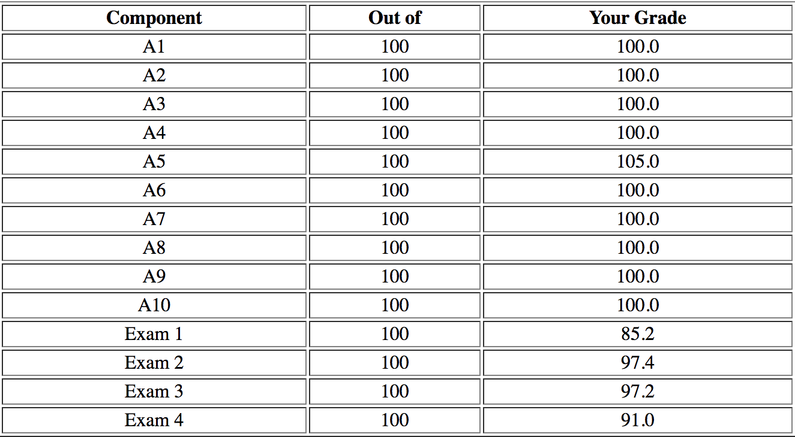

# WLP4-Compiler
A compiler of WLP4, which is the subset of C. If you are interested in the source code, please contact me.

- WLP4 = “Waterloo, Language, Plus, Pointers, Plus, Procedures”
- [WLP4 Language Tutorial](https://www.student.cs.uwaterloo.ca/~cs241/wlp4/WLP4tutorial.html)
- [WLP4 Language Specification](https://www.student.cs.uwaterloo.ca/~cs241/wlp4/WLP4.html)

---
The assignments and exams throughout the term involve MIPS assembly programming, assembler, regular languages, scanning, parsing, code generation, compiler optimizations, memory management, linking and loading.

Here are my grades of assignments and exams:

